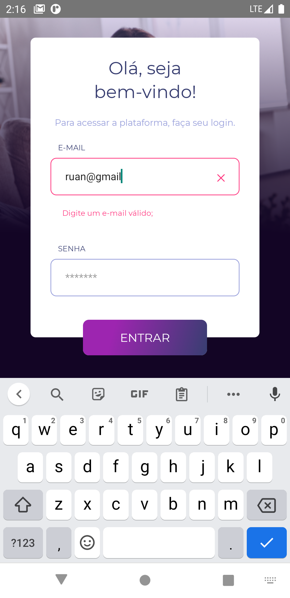
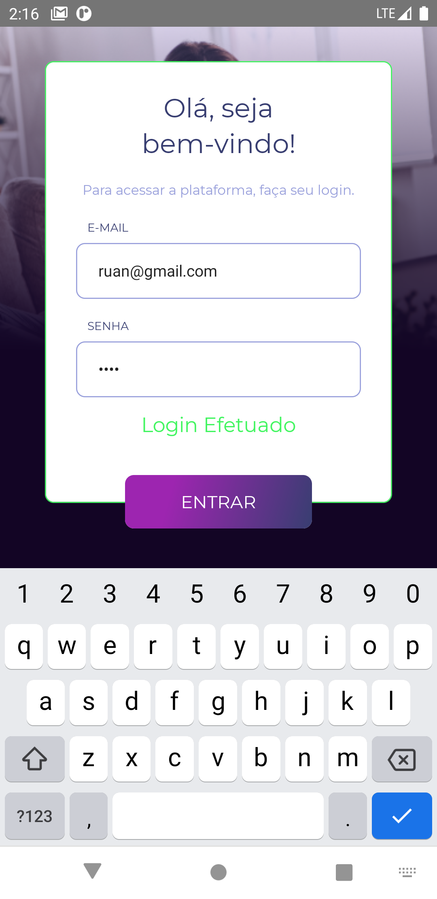

<h1 align="center">
    
</h1>

<p align="center">
<b>Teste Wiser</b><br/>
Esse repositório é Referente ao Teste da Wiser educação.
</p>

<p align="center">
  <a href="#sobre-este-projeto">Sobre este projeto</a>&nbsp;&nbsp;&nbsp;&#149;&nbsp;&nbsp;&nbsp;
  <a href="#tecnologias-utilizadas">Tecnologias Utilizadas</a>&nbsp;&nbsp;&nbsp;&#149;&nbsp;&nbsp;&nbsp;
  <a href="#screenshots">Screenshots</a>&nbsp;&nbsp;&nbsp;&#149;&nbsp;&nbsp;&nbsp;
  <a href="#testando">Testando</a>&nbsp;&nbsp;&nbsp;&nbsp;&nbsp;&nbsp;
</p>

## Sobre este projeto

Esse teste corresponde a desenvolver uma interface de Login utilizando as tecnologias requisitadas. Foi desenvolvido o aplicativo Mobile em React Native e também a aplicação online com React.

Você pode acessar a interface web <a href="https://wiser-teste-ruan.herokuapp.com" target="_blank">aqui.</a>
E fazer o download da aplicação **ANDROID**  <a href="" target="_blank">aqui.</a>

## Tecnologias Utilizadas

- React e React Native
- Redux e Redux Saga
- Hooks
- Typescript
- Styled Components
- Axios
- jest
- ESLint
- Prettier
- Heroku

## Screenshots

<h1 align="center">
    Aplicativo Mobile
</h1>


- Login View
<h1 align="center">
    
</h1>


- Email Errado
<h1 align="center">
    
</h1>

- Autenticação válida
<h1 align="center">
    
</h1>

- Autenticação inválida
<h1 align="center">
    
</h1>


## Testando

### Aplicação Online


Você pode acessar a interface web <a href="https://wiser-teste-ruan.herokuapp.com" target="_blank">aqui.</a>


```bash
Email válido: `wiser@wisereducacao.com`
Senha: `wisereducacao`
```

### Aplicação Android

A versão do APK pode ser baixada <a href="#" target="_blank">aqui.</a>

Ou preferir pode ser feita a instalação e executada localmente seguindo os passos.

```bash
#Download do repositório:
git clone https://github.com/AguaPotavel/Wteste.git

#Acessando a respectiva pasta:
$ cd React-Native/testeWiser#

#Instalando as dependências:
$ npm install

#Execute a aplicação:
$ npx react-native run-android
```