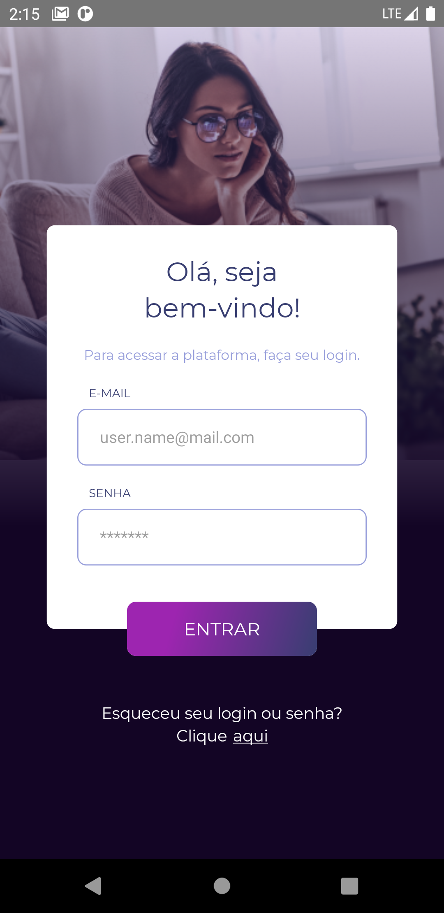

<h1 align="center">
    
</h1>

<p align="center">
<b>Teste Wiser</b><br/>
Esse repositório é Referente ao Teste da Wiser educação.
</p>

<p align="center">
  <a href="#sobre-este-projeto">Sobre este projeto</a>&nbsp;&nbsp;&nbsp;&#149;&nbsp;&nbsp;&nbsp;
  <a href="#tecnologias-utilizadas">Tecnologias Utilizadas</a>&nbsp;&nbsp;&nbsp;&#149;&nbsp;&nbsp;&nbsp;
  <a href="#screenshots">Screenshots</a>&nbsp;&nbsp;&nbsp;&#149;&nbsp;&nbsp;&nbsp;
  <a href="#iniciando">Testando</a>&nbsp;&nbsp;&nbsp;&#149;&nbsp;&nbsp;&nbsp;
  <a href="#melhorias-necessarias">Melhorias Necesárias</a>&nbsp;&nbsp;&nbsp;&nbsp;&nbsp;&nbsp;
</p>

## Sobre este projeto

Esse teste corresponde a desenvolver uma interface de Login utilizando as tecnologias requisitadas. Foi desenvolvido o aplicativo Mobile em React Native e também a aplicação online com React.

Você pode acessar a interface web <a href="https://wiser-teste-ruan.herokuapp.com" target="_blank">aqui.</a>
E fazer o download da aplicação **ANDROID**  <a href="https://github.com/AguaPotavel/Wteste/raw/main/Release/release-v1.apk" target="_blank">aqui.</a>

## Tecnologias Utilizadas

- React e React Native
- Redux e Redux Saga
- Hooks
- Typescript
- Styled Components
- Axios
- jest
- ESLint
- Prettier
- Heroku

## Screenshots

<h1 align="center">
    Aplicativo Mobile
</h1>


- Login e erro no email
<h1 align="center">
    
     
</h1>


- Login válido e inválido
<h1 align="center">
    
    
</h1>

<h1 align="center">
    Aplicação Web
</h1>

- Página web convencional
<h1 align="center">
        
</h1>

- Página web Tablet
<h1 align="center">
    
</h1>

- Página web celular
<h1 align="center">
    
</h1>

- Exemplo de Login Mal-sucedido
<h1 align="center">
    
</h1>


## Iniciando

### Aplicação Online


Você pode acessar a interface web <a href="https://wiser-teste-ruan.herokuapp.com" target="_blank">aqui.</a>


```bash
Email válido: `wiser@wisereducacao.com`
Senha: `wisereducacao`
```

### Aplicação Android

A versão do APK pode ser baixada <a href="https://github.com/AguaPotavel/Wteste/raw/main/Release/release-v1.apk" target="_blank">aqui.</a>

Ou se preferir pode ser feita a instalação e executada localmente seguindo os passos.

```bash
#Download do repositório:
git clone https://github.com/AguaPotavel/Wteste.git

#Acessando a respectiva pasta:
$ cd React-Native/testeWiser#

#Instalando as dependências:
$ npm install

#Execute a aplicação:
$ npx react-native run-android
```


## Melhorias Necessárias

Devido ao curto prazo com o qual foi proposto não pude concluir todas as coisas que eu havia pensado, as melhorias que caberiam ao projeto são as seguintes.


- Melhorar a responsividade do aplicativo mobile para outros celulares
    - Celulares com telas diferentes e outros dispositivos
- Melhorar a estrutura de pastas
    - devido ao projeto ser simples, não ter outras páginas e outras funções, não encontrei uma maneira adequada de refatorar o projeto para melhor organização, dado o fato de não saber quais componentes poderiam ser reutilizados.
- Modal no aplicativo
    - Poderia ser utilizado um modal para notificar o usuário do login efetuado no aplicativo.
- Versão Ios
    - O aplicativo sendo em react-native pode ja estar funcionando em Iphone, mas não pude testar isso pois não tenho como compilar para Ios.
- Testes
    - A versão do aplicativo possui testes de renderização, porém a versão web não possui testes, poderia ser melhor trabalhado os testes em ambas.
